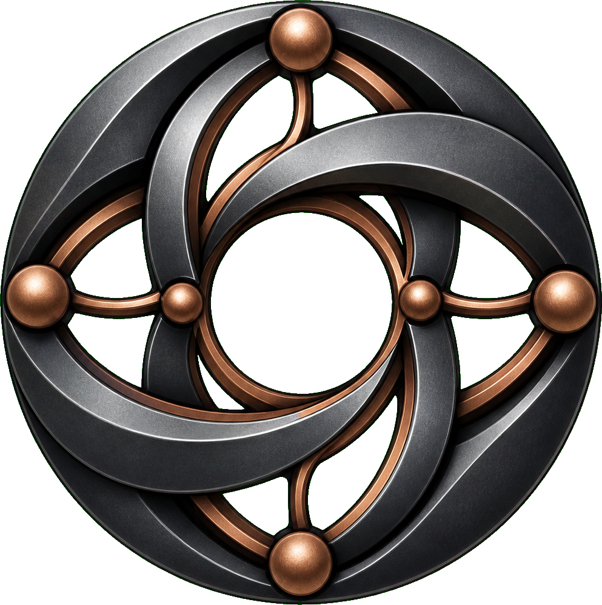

# Eyeron

<p align="center">
  
</p>

**Eyeron** is a Rust-based Notation3 (N3) reasoner that turns facts and rules
into conclusions with verifiable proofs. It runs as a command-line program, a
Rust library, or WebAssembly in the browser.

The name combines **Eye** with the sound of **iron**: explainable reasoning in
the Eyereasoner family, built as a small and strong tool.

## Start here

Read [The Art of Eyeron](https://eyereasoner.github.io/eyeron/the-art-of-eyeron) for the language, reasoning
model, built-ins, proofs, RDF and RDF Message boundaries, APIs, command-line
reference, implementation tour, and laboratories.

Or [try Eyeron in the browser](https://eyereasoner.github.io/eyeron/playground).

## Quick start

Build and run the first example:

```sh
cargo build --release
cargo run --release -- examples/socrates.n3
```

Inspect its proof:

```sh
cargo run --release -- --proof examples/socrates.n3
```

The example derives that Socrates is mortal:

```n3
@prefix : <http://example.org/>.

:Socrates a :Human.
{ ?person a :Human. } => { ?person a :Mortal. }.
```

Eyeron supports forward and goal-directed backward rules, generated rules,
quoted formulas, lists, logical and data built-ins, queries, proof output, RDF
1.1/1.2 input profiles, RDF Message replay and streaming, and reusable native
and browser sessions.

## Use as a Rust library

```rust
fn main() -> eyeron::Result<()> {
    let output = eyeron::reason(r#"
        @prefix : <http://example.org/>.
        :Socrates a :Human.
        { ?x a :Human. } => { ?x a :Mortal. }.
    "#)?;

    assert!(output.contains(":Socrates a :Mortal"));
    Ok(())
}
```

## Test

Run the complete optimized suite:

```sh
cargo test --release
```

It covers parser and built-in unit tests, CLI behavior, regressions, packaged
examples and proofs, the bundled Notation3 suite, and W3C RDF 1.1/1.2
manifests.

## Repository

```text
src/                  Parser, reasoner, proofs, output, CLI, and Wasm API
examples/             Runnable N3 and RDF Message programs
examples/output/      Expected derived output
examples/proof/       Expected proof output
tests/                Regression, integration, and conformance tests
the-art-of-eyeron.md   User guide, reference, and implementation tour
```

Eyeron is MIT licensed. See [LICENSE.md](LICENSE.md).
