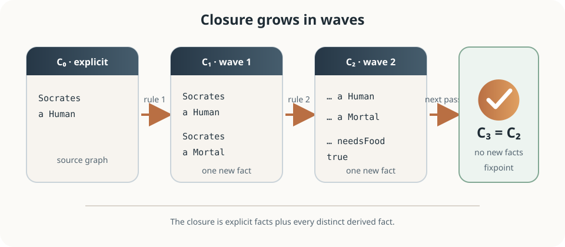
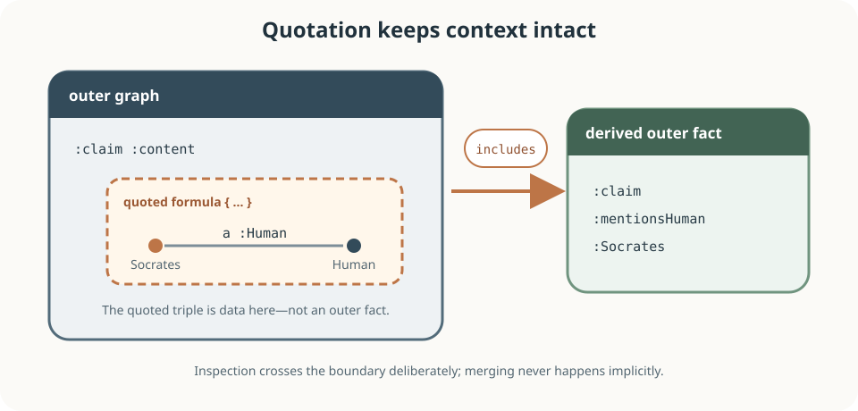
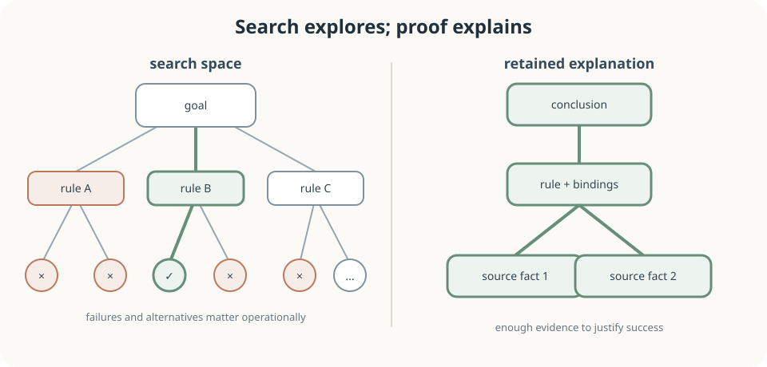
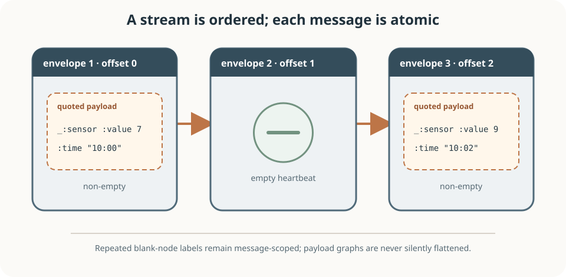

# The Art of Eyeron

<p align="center">
  
</p>

## Facts, rules, fixpoints, and proofs in Notation3

Eyeron turns RDF-shaped facts and Notation3 rules into conclusions with
inspectable proofs. This book is an introduction to the habits behind that
process: name a world carefully, write implications that preserve meaning, let
the reasoner compute a closure, and treat the resulting proof as part of the
answer.

It is also a practical guide to the Eyeron implementation. The chapters explain
the language Eyeron accepts, the way its forward and backward rules cooperate,
the role of built-ins and quoted formulas, and the boundaries of its command
line, Rust, WebAssembly, RDF, and RDF Message interfaces.

The subject is not syntax alone. An N3 rule has at least three readings:

- as a logical implication between graph patterns;
- as a join whose variables must acquire usable bindings; and
- as a production step that may add facts to a growing closure.

Good Eyeron programs keep all three readings aligned.

The name *Eyeron* combines *Eye* with the sound of *iron*. The first half places
it in the Eyereasoner family; the second suggests a small, strong tool. Eyeron
does not try to reproduce every feature of every historical N3 implementation.
It concentrates on useful N3 reasoning, deterministic execution, RDF
compatibility, proof output, and deployment from a native Rust binary to a
browser.

This places Eyeron at the meeting point of several traditions. RDF contributes
a universal graph data model. Notation3 adds variables, quoted graphs, and
rules. Deductive databases contribute joins, indexes, closure, and fixpoints.
Logic programming contributes unification and goal-directed reasoning.
Automated deduction contributes the demand that a conclusion be accompanied by
evidence.

That mixture explains the central theme of this book:

> A reasoner is most useful when the data boundary, the inference boundary, and
> the evidence boundary remain visible.

The best way to read is beside a running checkout. Build once:

```sh
cargo build --release
```

Then begin with:

```sh
cargo run --release -- examples/socrates.n3
cargo run --release -- --proof examples/socrates.n3
```

Readers who do not want to install Rust can use the
[browser playground](https://eyereasoner.github.io/eyeron/playground). The
playground and native executable share the same core reasoner, though local
files, URLs, and streaming naturally belong to the native interface.

### Reading conventions

- An `n3` block is Eyeron input. A block containing prefixes is intended to be
  runnable on its own unless the surrounding text says otherwise.
- A `text` block shows output, bindings, a graph shape, or pseudocode.
- A `sh`, `rust`, or `js` block belongs to the host environment.
- Normal CLI output contains newly derived results, not a copy of every input
  fact.
- Prefix spellings may change in output; IRIs, not prefixes, carry identity.

The repository already contains a broad executable corpus under
[`examples/`](examples/), expected derived output under
[`examples/output/`](examples/output/), and selected proof output under
[`examples/proof/`](examples/proof/). The examples in this book favor small
programs that expose one idea at a time.

### The promise of this book

By the end, a reader should be able to:

1. model a domain as RDF terms and triples with precise meanings;
2. read a rule as implication, join, and materialization step;
3. predict the closure of a finite rule set and recognize unsafe growth;
4. choose between forward rules, backward rules, scoped formulas, and queries;
5. use lists, arithmetic, strings, time, cryptography, and logical built-ins
   without confusing computation with asserted knowledge;
6. inspect proof output and distinguish an explanation from the search that
   found it;
7. preserve graph and message boundaries when processing contextual data; and
8. embed Eyeron without hiding completion status, limits, or semantic errors.

### A working discipline

Approach each program through six moves:

1. **Sentence.** Say what every predicate means in a ground triple.
2. **Scope.** Identify which graph or message each fact belongs to.
3. **Bindings.** Mark where every premise variable first becomes known.
4. **Closure.** Predict which facts appear in each wave of inference.
5. **Evidence.** Inspect the proof for an important conclusion.
6. **Revision.** Change one fact or rule and state what should remain invariant.

When a run surprises you, reduce the problem to one disputed ground triple.
Check the exact IRI, then each premise from left to right, then the scope of any
formula, then whether the run completed. Only after those checks should you
change the rule.

## Contents

### Part I — Graphs and implications

1. [A graph is a little world](#1-a-graph-is-a-little-world)
2. [Terms, names, and identity](#2-terms-names-and-identity)
3. [Rules have three readings](#3-rules-have-three-readings)
4. [Closure and the fixpoint](#4-closure-and-the-fixpoint)
5. [Recursion as reachability](#5-recursion-as-reachability)

### Part II — The N3 toolbox

6. [Lists and structured terms](#6-lists-and-structured-terms)
7. [Built-ins as relations](#7-built-ins-as-relations)
8. [Quoted formulas and scope](#8-quoted-formulas-and-scope)
9. [Existentials and generated identity](#9-existentials-and-generated-identity)
10. [Queries and human-facing output](#10-queries-and-human-facing-output)

### Part III — Reasoning with care

11. [Forward and backward rules](#11-forward-and-backward-rules)
12. [Negation, collection, and completed scope](#12-negation-collection-and-completed-scope)
13. [Proofs as first-class output](#13-proofs-as-first-class-output)
14. [Termination, limits, and performance](#14-termination-limits-and-performance)
15. [Debugging by graph, binding, and phase](#15-debugging-by-graph-binding-and-phase)

### Part IV — Boundaries and deployment

16. [RDF input and output](#16-rdf-input-and-output)
17. [RDF Messages](#17-rdf-messages)
18. [Embedding in Rust and JavaScript](#18-embedding-in-rust-and-javascript)
19. [Knowledge engineering as boundary design](#19-knowledge-engineering-as-boundary-design)
20. [From examples to dependable systems](#20-from-examples-to-dependable-systems)

### Appendices

- [A. Language summary](#appendix-a-language-summary)
- [B. Built-in families](#appendix-b-built-in-families)
- [C. Command-line reference](#appendix-c-command-line-reference)
- [D. Program patterns](#appendix-d-program-patterns)
- [E. Study routes and laboratories](#appendix-e-study-routes-and-laboratories)
- [F. Glossary](#appendix-f-glossary)
- [G. Reading the implementation](#appendix-g-reading-the-implementation)

---

# Part I — Graphs and implications

We begin with graph-shaped statements. Before rules can infer anything, names
must denote consistently and triples must say something clear.

## 1. A graph is a little world

RDF starts from a remarkably spare sentence form:

```text
subject — predicate → object
```

In N3, a fact ends with a dot:

```n3
@prefix : <http://example.org/art#>.

:Socrates a :Human.
:Socrates :teacherOf :Plato.
```

The first triple says that Socrates has type Human. The second says that
Socrates teaches Plato. The compact word `a` abbreviates `rdf:type`.

The graph does not require every resource to have a record in one place.
Additional statements can arrive in another file:

```n3
@prefix : <http://example.org/art#>.

:Plato a :Human;
    :teacherOf :Aristotle.
```

The semicolon repeats the subject. A comma repeats subject and predicate:

```n3
@prefix : <http://example.org/art#>.

:Ada :knows :Grace, :Charles.
```

These are writing conveniences. Reasoning still operates over triples.

The open-world habit is essential. Absence of `:Ada :knows :Linus` is not an
assertion that Ada does not know Linus. It merely means that this graph does not
establish that relationship. Later chapters show how `log:notIncludes` asks
about absence in a completed scope; that is a controlled operation, not a
global license to turn missing facts into falsehood.

### First derivation

Save the following as `human.n3`:

```n3
@prefix : <http://example.org/art#>.

:Socrates a :Human.

{ ?person a :Human. } => { ?person a :Mortal. }.
```

Run:

```sh
cargo run --release -- human.n3
```

The derived result is:

```n3
:Socrates a :Mortal.
```

Eyeron does not normally print the input fact again. Its output answers the
question “what was newly derived?” The full internal closure contains both
facts.

### Exercise

Add `:Plato a :Human`. Predict the new output before running. Then replace
`:Human` in the rule body with `:Person` and explain the empty result without
using the word “bug.”

## 2. Terms, names, and identity

A triple position contains a term. Eyeron supports IRIs, variables, blank
nodes, literals, lists, and quoted formulas.

### IRIs and prefixes

An IRI is a global name:

```n3
<http://example.org/art#Socrates>
    <http://www.w3.org/1999/02/22-rdf-syntax-ns#type>
    <http://example.org/art#Human>.
```

Prefixes make the same statement readable:

```n3
@prefix : <http://example.org/art#>.

:Socrates a :Human.
```

Prefixes are aliases, not namespaces inside the reasoner. Two different prefix
labels can expand to the same IRI; the expanded IRI determines identity.
Relative IRIs are resolved against a base. For portable command-line work,
declare `@base`, use absolute IRIs, or pass `--base-iri`.

### Variables

Variables begin with `?`:

```n3
?person :knows ?friend.
```

In a rule body, a variable requests a consistent binding. If `?person` occurs
three times, all three occurrences must denote the same term within that rule
match.

Variables are not string placeholders. Binding `?x` to `:Ada` produces the IRI
term `:Ada`, not the characters `":Ada"`.

### Literals

Literals carry values and may carry datatypes or language tags:

```n3
@prefix : <http://example.org/art#>.
@prefix xsd: <http://www.w3.org/2001/XMLSchema#>.

:reading :count 3;
    :ratio 2.5;
    :active true;
    :label "bonjour"@fr;
    :stamp "2026-07-27T12:00:00Z"^^xsd:dateTime.
```

Numeric built-ins compare numeric values. String built-ins operate on lexical
content. Preserve that distinction: the number `12` and the string `"12"` are
not interchangeable just because a person reads them similarly.

### Blank nodes

A blank node names a resource only locally:

```n3
@prefix : <http://example.org/art#>.

:Ada :address [ :city "Brussels"; :postcode "1000" ].
```

The bracketed property list creates an unnamed address resource. A blank node
is not “unknown text” and is not a wildcard. Reusing its label within its scope
refers to the same local resource.

### Groundness

A term or triple is *ground* when it contains no variables. Ground facts can be
placed in the established closure. Patterns containing variables are matched
against that closure. The distinction gives a useful diagnostic question:

> Is this expression knowledge to store, or a pattern to solve?

## 3. Rules have three readings

Consider:

```n3
@prefix : <http://example.org/art#>.

{
    ?child :parent ?parent.
    ?parent :parent ?grandparent.
} => {
    ?child :grandparent ?grandparent.
}.
```

### Logical reading

For every child, parent, and grandparent: if the first is parent-linked to the
second and the second to the third, then the first is grandparent-linked to the
third.

This reading is independent of a particular dataset.

### Join reading

The two body triples form a join on `?parent`. With:

```n3
:Ada :parent :Bea.
:Bea :parent :Cy.
```

the first pattern binds `?child = :Ada` and `?parent = :Bea`; the second uses
that binding and adds `?grandparent = :Cy`.

### Production reading

After a complete body match, Eyeron substitutes the bindings into the head and
inserts:

```n3
:Ada :grandparent :Cy.
```

If that fact already exists, inserting it changes nothing. Duplicate
suppression is what lets monotonic materialization reach a fixpoint.

### Direction is syntax

The arrow points from premise formula to conclusion formula:

```n3
{ premise } => { conclusion }.
```

Moving a triple across the arrow changes the rule. The implication is not
automatically reversible. If humans imply mortals, mortals do not thereby
imply humans.

### Empty bodies

An empty body is always satisfied:

```n3
@prefix : <http://example.org/art#>.

{} => { :run :started true. }.
```

This is occasionally useful for seeds, but an ordinary input fact is clearer
when no rule behavior is intended.

## 4. Closure and the fixpoint

<figure>
  
  <figcaption>Inference proceeds in waves. The first unchanged closure is the fixpoint.</figcaption>
</figure>

Rules may enable other rules:

```n3
@prefix : <http://example.org/art#>.

:Socrates a :Human.

{ ?x a :Human. } => { ?x a :Mortal. }.
{ ?x a :Mortal. } => { ?x :needsFood true. }.
```

An informal execution is:

```text
C0 = { Socrates is Human }
C1 = C0 + { Socrates is Mortal }
C2 = C1 + { Socrates needsFood true }
C3 = C2
```

Because the final pass adds nothing, `C2` is a fixpoint.

The order in which rules are written should not change the logical closure of a
well-behaved monotonic program. It can change operational cost. Eyeron uses
indexes and an agenda path where possible, but program shape still matters.

### Monotonicity

Ordinary forward rules only add conclusions. They do not retract them. If more
input facts are added, previously derived ordinary facts remain justified.
This property makes closure understandable and incremental algorithms possible.

Scoped absence and aggregation require more care because an answer based on an
incomplete graph could become wrong when the graph grows. Eyeron therefore
defers `log:notIncludes`, `log:collectAllIn`, and `log:forAllIn` until ordinary
forward saturation. Chapter 12 develops the consequence.

### Explicit, derived, and closure

Keep three sets conceptually separate:

```text
explicit = parsed source facts
derived  = new materialized facts
closure  = explicit ∪ derived
```

The CLI normally prints `derived`. The library result exposes all three. A test
that expects source facts in normal output is testing the wrong boundary.

## 5. Recursion as reachability

Recursion becomes concrete in a graph:

```n3
@prefix : <http://example.org/art#>.

:a :edge :b.
:b :edge :c.
:c :edge :d.

{ ?x :edge ?y. } => { ?x :reaches ?y. }.
{
    ?x :edge ?via.
    ?via :reaches ?y.
} => {
    ?x :reaches ?y.
}.
```

The base rule turns direct edges into reachability. The recursive rule extends
a known path by one edge. The closure contains:

```text
a reaches b, c, d
b reaches c, d
c reaches d
```

This program terminates because the input has finitely many nodes and the rule
can only produce finitely many ordered pairs over those nodes.

### Recursion is induction in motion

The base rule corresponds to a base case. The recursive rule corresponds to an
inductive step. A proof of `:a :reaches :d` is also a record of repeated
inductive construction.

### Cycles

Add `:d :edge :a`. The graph now admits cyclic paths, but the set of distinct
ground pairs is still finite. Duplicate suppression prevents the reasoner from
adding the same reachability fact forever.

Termination depends on the number of distinct facts, not on whether the
operational story contains repeated walks. A rule that generates fresh
structure can still grow without bound; Chapter 14 treats that danger.

---

# Part II — The N3 toolbox

N3 extends flat triples with structured terms, quoted graphs, and relations
that compute. These features are powerful precisely because their scopes and
binding requirements can be stated.

## 6. Lists and structured terms

An N3 list is a first-class term:

```n3
@prefix : <http://example.org/art#>.

:route :stops (:Brussels :Leuven :Liege).
```

It may occur in any term position, including the subject of a built-in:

```n3
@prefix : <http://example.org/art#>.
@prefix list: <http://www.w3.org/2000/10/swap/list#>.

{
    :route :stops ?stops.
    ?stops list:length ?length.
} => {
    :route :stopCount ?length.
}.

:route :stops (:Brussels :Leuven :Liege).
```

Eyeron keeps native lists as list terms instead of flooding the closure with
structural `rdf:first` and `rdf:rest` triples. Rules can nevertheless match a
native list through virtual RDF collection behavior or use `list:` built-ins.

### Decomposition

```n3
@prefix : <http://example.org/art#>.
@prefix list: <http://www.w3.org/2000/10/swap/list#>.

{
    :queue :items ?items.
    ?items list:firstRest (?first ?rest).
} => {
    :queue :next ?first;
        :remaining ?rest.
}.

:queue :items (:a :b :c).
```

`list:firstRest` relates a list to a two-item list containing its first item and
remaining list. This relational shape is worth learning from examples rather
than guessing from an imperative method name.

### Lists as arguments

Many arithmetic and string relations place their inputs in a list:

```n3
(2 3) math:sum 5.
("north-" "42") string:concatenation "north-42".
```

The subject is the argument tuple; the object is the result. A rule may know
the arguments and solve for the result, or—where that built-in supports it—know
enough other positions to solve another way.

### Representation discipline

Do not use a list when order is irrelevant and graph edges would be clearer.
Do use one when order, multiplicity, or a compound built-in argument matters.
Representation is part of the contract: changing a set of triples into a list
changes both meaning and available matching operations.

## 7. Built-ins as relations

A built-in looks like a triple but is evaluated by the reasoner:

```n3
@prefix : <http://example.org/art#>.
@prefix math: <http://www.w3.org/2000/10/swap/math#>.

{
    :invoice :net ?net;
        :tax ?tax.
    (?net ?tax) math:sum ?gross.
} => {
    :invoice :gross ?gross.
}.

:invoice :net 100;
    :tax 21.
```

The built-in premise succeeds with `?gross = 121`.

### Binding readiness

Built-ins have usable modes. `(?net ?tax) math:sum ?gross` is ready when the
inputs are numeric. If none of its positions is sufficiently bound, it cannot
invent an unbounded universe of numbers.

A useful body order is:

```text
graph patterns that bind variables
then built-ins that compute or test them
then patterns that use the computed values
```

Eyeron can solve many patterns flexibly, but no implementation can enumerate
every possible string, number, IRI, or date.

### Tests and constructors

Some built-ins primarily test:

```n3
?age math:greaterThan 17.
?name string:startsWith "A".
```

Others construct:

```n3
(?a ?b) math:product ?p.
(?left ?right) string:concatenation ?whole.
?resource log:uri ?text.
```

The distinction is operational, not ontological: both are relations in the
rule body. Ask which positions are known at call time.

### Built-ins do not assert themselves

Successful evaluation of:

```n3
(2 3) math:sum ?n.
```

binds `?n`; it does not add a permanent `math:sum` triple to the closure.
Knowledge becomes materialized only through the rule head.

## 8. Quoted formulas and scope

<figure>
  
  <figcaption>A quoted formula is data until a rule deliberately inspects it.</figcaption>
</figure>

Braces can denote a graph as a term:

```n3
@prefix : <http://example.org/art#>.

:claim :content { :Socrates a :Human. }.
```

The inner triple is quoted. It is data about a claim, not automatically a fact
in the outer graph. This single distinction prevents many serious modeling
errors.

### Inspecting a formula

```n3
@prefix : <http://example.org/art#>.
@prefix log: <http://www.w3.org/2000/10/swap/log#>.

:claim :content { :Socrates a :Human. }.

{
    :claim :content ?graph.
    ?graph log:includes { :Socrates a :Human. }.
} => {
    :claim :mentionsHumanSocrates true.
}.
```

`log:includes` matches within the quoted graph. It does not merge that graph
into the outer closure.

### Reasoning inside a formula

`log:conclusion` computes the closure of a quoted theory:

```n3
@prefix : <http://example.org/art#>.
@prefix log: <http://www.w3.org/2000/10/swap/log#>.

:theory :content {
    :Felix a :Cat.
    { ?x a :Cat. } => { ?x :says "Meow". }.
}.

{
    :theory :content ?theory.
    ?theory log:conclusion ?closure.
} => {
    :theory :conclusion ?closure.
}.
```

This is reasoning about a theory as a value. It does not silently promote the
theory's facts into the surrounding graph.

### Formula identity and equality

Quoted formulas are structural terms. Do not confuse “these formulas contain
matching triples” with “these resources are the same named graph.” Use explicit
predicates for provenance, authorship, or graph names, and use logical built-ins
for formula inspection.

## 9. Existentials and generated identity

A blank node in a rule conclusion represents an existential witness:

```n3
@prefix : <http://example.org/art#>.

:Socrates a :Human.
:Plato a :Human.

{
    ?person a :Human.
} => {
    ?person :hasStatus [ a :MortalStatus ].
}.
```

Each distinct successful firing needs an appropriate local witness. Socrates'
status need not be Plato's status.

Eyeron generates conclusion blank nodes deterministically for repeated
firings. If the same logical firing is revisited while reaching the fixpoint,
it produces the same witness rather than an endless stream of fresh blank
nodes.

### Do not mint when you mean identify

If a stable real-world identifier already exists, use its IRI. Use a conclusion
blank node when the rule justifies the existence of something but does not
justify a global name.

This is a semantic choice:

```text
IRI         known global identity
blank node  local existential identity
variable    a pattern position awaiting a binding
```

Confusing the three creates joins that are either accidentally impossible or
accidentally broad.

## 10. Queries and human-facing output

Rules usually materialize triples. N3 queries can instead select bindings and
produce output:

```n3
@prefix : <http://example.org/art#>.
@prefix log: <http://www.w3.org/2000/10/swap/log#>.

:Ada :greeting "hello".

{
    :Ada :greeting ?text.
} log:query {
    :result log:outputString ?text.
}.
```

This emits:

```text
hello
```

Queries are evaluated against the completed closure. That makes them a clean
presentation boundary: rules establish knowledge first; a query selects what a
human or downstream text consumer should see.

`log:outputString` is deliberately different from an RDF fact. Text output is
not suitable for later graph joins. Keep machine conclusions in triples and
use formatted strings at the outermost reporting edge.

### Separate verdict from explanation

A dependable policy program often derives:

```n3
:request :decision :Permit.
:request :because :ValidPurpose.
```

and then formats a sentence from those established facts. This keeps the
machine-readable verdict available even if the prose changes.

---

# Part III — Reasoning with care

Powerful rule systems need more than successful examples. They need a clear
account of direction, completion, evidence, and failure.

## 11. Forward and backward rules

A forward rule says “when this body is established, materialize that head”:

```n3
{ ?x a :Human. } => { ?x a :Mortal. }.
```

A backward rule uses `<=`:

```n3
@prefix : <http://example.org/art#>.
@prefix math: <http://www.w3.org/2000/10/swap/math#>.

{
    ?x :moreInterestingThan ?y.
} <= {
    ?x math:greaterThan ?y.
}.

{
    5 :moreInterestingThan 3.
} => {
    :test :passed true.
}.
```

When the forward body's goal `5 :moreInterestingThan 3` is not an ordinary
fact, Eyeron can use the backward rule to reduce it to the built-in goal
`5 math:greaterThan 3`.

### Choose direction by use

Use forward rules when:

- conclusions should be reusable by many later rules;
- the closure is a useful product;
- the domain is finite enough to materialize; or
- proof and RDF output should expose the derived fact.

Use backward rules when:

- only a small family of goals will be asked;
- materializing every possible answer would be wasteful;
- the relation is naturally recursive and goal-directed; or
- an intermediate relation exists mainly to solve other premises.

The two styles can cooperate, but a cycle through both deserves careful
termination analysis.

### The head is an interface

Read a backward rule's head as a callable relation. Document its expected
binding modes: will callers know both arguments, one argument, or neither?
A beautifully declarative definition may still be unusable for an unbounded
call.

## 12. Negation, collection, and completed scope

Three operations depend on knowing enough of a graph:

- `log:notIncludes` asks that a formula does not contain a match;
- `log:collectAllIn` gathers all matches in a scope;
- `log:forAllIn` checks a universal condition over scoped matches.

Evaluating any of them too early can produce a conclusion that later facts
invalidate.

### Scoped absence

```n3
@prefix : <http://example.org/art#>.
@prefix log: <http://www.w3.org/2000/10/swap/log#>.

:box :contents { :apple a :Fruit. }.

{
    :box :contents ?contents.
    ?contents log:notIncludes { ?thing a :Hazard. }.
} => {
    :box :hazardFree true.
}.
```

This does not prove that hazards do not exist anywhere. It establishes that the
given formula lacks a matching hazard assertion after its relevant reasoning
phase.

### Collection

```n3
@prefix : <http://example.org/art#>.
@prefix log: <http://www.w3.org/2000/10/swap/log#>.

:team :member :Ada, :Grace, :Linus.

{
    (?member { :team :member ?member. } ?members)
        log:collectAllIn _:scope.
} => {
    :team :memberList ?members.
}.
```

The collected variable, formula to search, and result list are packaged in the
subject list. Collection is about a defined scope, not about an implicit global
database.

### Universal conditions

```n3
@prefix : <http://example.org/art#>.
@prefix log: <http://www.w3.org/2000/10/swap/log#>.

:project :task :one, :two.
:one :state :Done.
:two :state :Done.

{
    (
      { :project :task ?task. }
      { ?task :state :Done. }
    ) log:forAllIn _:scope.
} => {
    :project :complete true.
}.
```

State the population formula carefully. A universal over an empty population
may be vacuously true; if the business rule requires at least one task, assert
that separately.

### Eyeron's phase discipline

Eyeron first saturates ordinary forward reasoning, then evaluates deferred
scoped operations. If those add facts, ordinary reasoning resumes, and the
process repeats until neither phase adds anything.

This protects against premature aggregate and negative results, but it cannot
repair a vague scope. The modeler still owns the boundary.

## 13. Proofs as first-class output

<figure>
  
  <figcaption>A proof justifies a successful conclusion; it need not reproduce every failed search branch.</figcaption>
</figure>

Run:

```sh
cargo run --release -- --proof examples/socrates.n3
```

Instead of ordinary derived output, Eyeron emits an N3 proof explanation. A
proof connects conclusions to source facts, rules, and substitutions.

Proofs answer:

- Which rule justified this fact?
- Which premise facts were used?
- Which variable bindings connected them?
- Where did the source statements come from?

They do not necessarily record every failed match or every internal index
lookup. An explanation of success is not a transcript of the entire search.

### Proof-driven development

For an important verdict:

1. write the expected ground conclusion;
2. run with `--proof`;
3. find the inference that concludes it;
4. inspect each premise and binding;
5. challenge one premise by removing or changing its source fact; and
6. preserve the case as a regression test.

This is stronger than snapshotting only the final string. It checks that the
answer is supported for the intended reason.

### Proofs and trust

A proof does not make bad premises true. It exposes dependence on them.
Trustworthy reasoning therefore has layers:

```text
source authenticity
        ↓
parsing and graph boundaries
        ↓
rule meaning
        ↓
derivation
        ↓
proof inspection
```

Eyeron chiefly addresses the middle and lower layers. Applications must still
decide which sources and rules are authorized.

## 14. Termination, limits, and performance

Forward reasoning terminates when only finitely many distinct facts can be
generated and the reasoner reaches them. Common ways to preserve finiteness
include:

- drawing conclusion terms from a finite input vocabulary;
- bounding numeric generation;
- ensuring recursion moves over a finite graph;
- using deterministic existential witnesses; and
- avoiding rules that construct ever-deeper lists or formulas.

### A dangerous shape

Conceptually, a rule like:

```text
x has value n  →  x has value n+1
```

has no fixpoint over unbounded integers. A seed of zero generates one, two,
three, and so on.

Add an explicit bound:

```n3
@prefix : <http://example.org/art#>.
@prefix math: <http://www.w3.org/2000/10/swap/math#>.

:counter :value 0;
    :limit 10.

{
    :counter :value ?n;
        :limit ?limit.
    ?n math:lessThan ?limit.
    (?n 1) math:sum ?next.
} => {
    :counter :value ?next.
}.
```

Now the invariant `0 ≤ value ≤ limit` supplies the finiteness argument.

### Cost is shaped by joins

A body with two broad patterns can form a large intermediate product. Prefer
selective constants and shared variables early:

```n3
?request a :UrgentRequest.
?request :owner ?owner.
?owner :clearance :High.
```

Eyeron's fact index uses predicates and known subject/predicate or
predicate/object pairs to narrow candidates. Suitable forward rules also use an
agenda path driven by newly added facts. These optimizations preserve meaning;
they do not make an infinite theory finite.

### Completion is data

The lower-level API returns status, reached safety limits, semantic errors, and
statistics. Do not treat an incomplete run as a negative answer. “Not derived
before a limit” and “false in the completed intended model” are different
claims.

## 15. Debugging by graph, binding, and phase

When an expected fact is missing, use this order.

### 1. Graph

Check the expanded IRIs, datatype, language tag, list structure, and formula
scope. Many reasoning failures are representation mismatches.

Use:

```sh
cargo run --release -- --ast your-file.n3
```

to inspect the parsed document.

### 2. Binding

Write a table for the body:

| Premise | Variables known before | Variables added |
| --- | --- | --- |
| `?x a :Human` | none | `?x` |
| `?x :age ?age` | `?x` | `?age` |
| `?age math:greaterThan 17` | `?age` | none |

If a built-in is reached without a usable mode, move or redesign the binding
source.

### 3. Phase

Ask whether the premise is:

- an ordinary fact match;
- a backward goal;
- a built-in;
- a scoped deferred operation; or
- a query evaluated after closure.

The same surface triple shape can hide different execution roles.

### 4. Completion

Inspect errors and limits. Empty ordinary output can mean:

- nothing new was derived;
- the desired fact was already explicit;
- a query printed an empty string;
- a premise failed;
- a built-in was not ready; or
- the run was incomplete.

### 5. Proof

For an unexpected success, proof output is usually the shortest path to the
cause. For an expected success that is absent, temporarily derive checkpoints
after successive subsets of the body.

### Minimal counterexamples

Reduce to one rule, the fewest facts needed to exercise it, and one expected
ground conclusion. Repair the model there, then restore surrounding complexity.

---

# Part IV — Boundaries and deployment

A reasoner becomes part of a system at its boundaries: input syntax, graph
scope, message scope, API results, and tests. These are semantic interfaces,
not packaging details.

## 16. RDF input and output

Eyeron's native rule language is N3. It also accepts RDF 1.1 and RDF 1.2 input
profiles for Turtle, N-Triples, N-Quads, and TriG.

File extensions select RDF syntax for `.ttl`, `.nt`, `.nq`, and `.trig`:

```sh
cargo run --release -- rules.n3 data.ttl
cargo run --release -- rules.n3 observations.nq
```

Use `--rdf` for RDF-compatible output or Turtle from standard input:

```sh
cargo run --release -- --rdf - < data.ttl
```

Multiple inputs are parsed and merged into one document in ordinary mode.
That is convenient only when merging matches the domain semantics. If named
graphs or message boundaries carry meaning, preserve and query them explicitly.

### N3 is more expressive than RDF

Variables, rules, and quoted formula terms do not all map to a plain RDF graph.
The `--rdf` boundary is therefore a compatibility boundary for suitable input
and derived output, not a claim that every N3 construct is ordinary RDF data.

### Conformance as engineering

The repository vendors N3 and W3C RDF test suites. Run:

```sh
cargo test --release
```

The W3C runner can be exercised separately:

```sh
cargo test --release --test w3c_rdf
```

Conformance tests protect syntax and data-model boundaries. Application tests
must additionally protect the meaning of local rules.

## 17. RDF Messages

<figure>
  
  <figcaption>Message order and payload scope survive replay; repeated local blank-node labels do not create cross-message identity.</figcaption>
</figure>

An RDF Message is an atomic dataset in an ordered stream. A Message Log records
that stream for replay. The word *atomic* matters: observations from different
messages must not be silently flattened into one timeless graph.

Eyeron recognizes logs with a `VERSION "*-messages"` directive and `MESSAGE` or
`@message .` boundaries.

In normal replay mode, it exposes an internal message view with ordered
envelopes, payload kinds, and a quoted payload formula for each non-empty
message. Rules can inspect a payload using `log:includes` while retaining its
context.

```sh
cargo run --release -- --rdf \
  examples/rdf-messages.n3 \
  examples/input/rdf-messages.trig
```

### Message-at-a-time processing

```sh
cargo run --release -- --rdf --stream-messages \
  examples/alma-rdf-messages.n3 \
  tests/input/alma-rdf-messages-small.nt
```

The program is prepared once; each message is reasoned over independently;
each result is written and flushed before the next message is read.

Current streamed batches do not retain derived facts between messages. This is
a guarantee to design around, not an incidental omission. If an application
needs a rolling window, persistent state, or cross-message joins, that state
must be modeled in a layer that deliberately owns it.

### Blank-node scope

Source-local blank-node labels can repeat in different messages without
identifying the same resource. Eyeron scopes them per message. Treating repeated
labels as global identity would corrupt the stream's meaning.

### Replay and live processing are different questions

Replay asks what can be inferred from the ordered log as a represented whole.
Streaming asks what can be inferred independently for each arriving message.
Choose the mode according to the application contract.

## 18. Embedding in Rust and JavaScript

The high-level Rust API accepts N3 and returns newly derived N3:

```rust
fn main() -> eyeron::Result<()> {
    let output = eyeron::reason(r#"
        @prefix : <http://example.org/art#>.

        :Socrates a :Human.
        { ?x a :Human. } => { ?x a :Mortal. }.
    "#)?;

    assert!(output.contains(":Socrates a :Mortal"));
    Ok(())
}
```

For production integration, parse explicitly and use `reason_document`. Its
`ReasonerResult` separates explicit, derived, and closure facts and reports
proofs, completion, limits, errors, and statistics.

The design lesson is simple: return semantic status with semantic output.

### Prepared reasoning

When one rule program serves many independent data batches, prepare it once.
`PreparedReasoner` reuses parsed rules and indexes while keeping each batch's
facts independent.

The browser API offers the same pattern through `EyeronSession`:

```js
const session = new EyeronSession(runtimeN3, false);
const output = session.reason(messageNQuads, true, "nquads");
const report = JSON.parse(
  session.reasonReport(nextMessageNQuads, true, "nquads")
);
session.free();
```

The constructor's Boolean enables proof output. The run arguments select RDF
output and input syntax. Free the session when its owner is done.

### API boundaries

Do not make downstream code scrape presentation text when structured result
objects are available. Keep:

- parse errors distinct from semantic errors;
- incomplete execution distinct from completed absence;
- derived output distinct from closure;
- proof data distinct from ordinary data; and
- independent batches distinct from persistent state.

## 19. Knowledge engineering as boundary design

Most difficult rule-engine problems are not failures of implication. They are
failures to state a boundary.

### Vocabulary boundary

Define every predicate in a ground sentence:

```text
request purpose Research
```

Does it mean the requester declared Research, an authority verified Research,
or the engine inferred Research? Those should often be different predicates.

### Authority boundary

Facts from a policy, a sensor, and a user form may share RDF syntax while having
different authority. Preserve provenance or graph context before rules combine
them.

### Time boundary

A monotonic closure does not automatically make facts expire. Model validity
intervals, observation times, or message windows when time changes meaning.

### Identity boundary

Use `owl:sameAs` or `=` only for genuine identity. A schema mapping, close
match, or application equivalence may warrant a narrower predicate. Identity
propagates more strongly than resemblance.

### Decision boundary

A policy result should expose:

```text
decision
supporting conditions
source or rule set
completion status
proof
```

A single Boolean discards too much information for audit and repair.

### One-way mappings

When aligning vocabularies, begin with the weakest rule justified by the source:

```n3
{ ?x :sourceStatus :Approved. } => { ?x :targetStatus :Accepted. }.
```

Do not add the reverse implication merely for symmetry. Mappings are claims,
not conveniences.

## 20. From examples to dependable systems

A tiny rule becomes dependable through a sequence of widening checks.

### 1. Examples

Write one positive case and one near miss. Predict both results.

### 2. Invariants

State what every derived fact guarantees. For reachability, every result must
correspond to a non-empty path in the source graph.

### 3. Metamorphic tests

Change input in ways with predictable effects:

- adding an unrelated fact should not alter a verdict;
- renaming a prefix should not alter identity;
- reordering source triples should not alter closure;
- adding a duplicate fact should not create a duplicate conclusion;
- changing a quoted fact should not alter the outer graph unless a rule
  explicitly inspects it.

### 4. Proof goldens

Keep selected proof outputs for decisions whose justification matters.

### 5. Conformance and regressions

Run the optimized suite:

```sh
cargo test --release
```

Focused checks include:

```sh
cargo test --release --test regressions
cargo test --release --test examples
cargo test --release --test playground
```

### 6. Adversarial limits

Test deep chains, broad joins, recursive backward goals, malformed input,
unready built-ins, and safety limits. A system that only tests happy-path
answers has not tested its reasoning boundary.

### The craft

The art of Eyeron is not the accumulation of ornate rules. It is the patient
alignment of meaning and mechanism:

- triples whose ground instances say exactly one thing;
- rules whose directions match their intended use;
- scopes that preserve context;
- finite searches whose completion can be trusted;
- proofs that expose dependence; and
- interfaces that do not erase status.

A small reasoner is enough to express deep arguments. Its smallness is an
advantage when the important seams remain visible.

---

# Appendix A. Language summary

## Core forms

```n3
@base <http://example.org/>.
@prefix ex: <http://example.org/ns#>.

ex:s ex:p ex:o.
ex:s ex:p ex:o1, ex:o2.
ex:s ex:p ex:o; ex:q ex:r.

{ ?s ex:p ?o. } => { ?s ex:q ?o. }.
{ ?s ex:q ?o. } <= { ?s ex:p ?o. }.

ex:claim ex:content { ex:s ex:p ex:o. }.
ex:s ex:items (ex:a ex:b ex:c).
ex:s ex:part [ ex:value 1 ].
```

Eyeron supports IRIs, prefixed names, variables, blank nodes, literals, lists,
quoted formulas, forward and backward rules, generated rules, quoted-formula
conclusions, `log:query`, and `log:outputString`.

## Matching

- Repeated variables must bind consistently.
- Lists match structurally.
- Formula terms unify as unordered collections of triples.
- Unification performs an occurs check.
- Native lists can be inspected through virtual `rdf:first` and `rdf:rest`
  matching.
- `=` provides `owl:sameAs` syntax in supported N3 input.

## Materialization

- Explicit facts seed the closure.
- Forward conclusions add unseen ground facts.
- New facts may trigger further rules.
- Generated rules are registered when their conclusions create rules.
- Conclusion blank nodes are deterministic per firing.
- Queries run against the completed closure.
- Scoped collection, universal, and negative operations are deferred until
  ordinary saturation and may cause another ordinary phase.

## Input profiles

- N3 is the native rule syntax.
- Turtle, N-Triples, N-Quads, and TriG are selected by extension or explicit
  RDF mode.
- RDF Message Logs use `VERSION "*-messages"` plus message delimiters.

# Appendix B. Built-in families

The following families are implemented. Exact usable modes matter; consult the
executable examples and tests when designing a non-obvious call.

## Logical (`log:`)

`equalTo`, `notEqualTo`, `collectAllIn`, `forAllIn`, `conclusion`,
`conjunction`, `includes`, `notIncludes`, `uri`, `rawType`, `dtlit`, `langlit`,
`content`, `semantics`, `semanticsOrError`, `parsedAsN3`, and `skolem`.

Use these for term equality, graph scope, quotation, parsing, and controlled
construction. External-resource behavior for semantic/content built-ins is
deliberately limited and deterministic; it is not a general network
dereferencer.

## Mathematics (`math:`)

`sum`, `difference`, `product`, `quotient`, `integerQuotient`, `remainder`,
`exponentiation`, `negation`, `absoluteValue`, `rounded`, `sin`, `cos`, `tan`,
`asin`, `acos`, `atan`, `sinh`, `cosh`, `tanh`, `degrees`, `greaterThan`,
`lessThan`, `notGreaterThan`, `notLessThan`, `equalTo`, and `notEqualTo`.

Keep datatype and domain expectations explicit. Bound generators.

## Lists (`list:`)

`first`, `rest`, `firstRest`, `last`, `length`, `member`, `memberAt`, `in`,
`notMember`, `remove`, `append`, `reverse`, `sort`, `iterate`, and `map`.

Native list operations preserve graph blank nodes. Sorting is lexicographic
over terms, with numeric literals ordered by numeric value.

## Strings (`string:`)

`lessThan`, `greaterThan`, `notLessThan`, `notGreaterThan`, `concatenation`,
`contains`, `containsIgnoringCase`, `startsWith`, `endsWith`,
`equalIgnoringCase`, `notEqualIgnoringCase`, `format`, `matches`, `notMatches`,
`replace`, and `scrape`.

Regular expressions use Rust's Unicode-aware regex engine, with compatibility
handling for conformance cases.

## Time (`time:`)

`year`, `month`, `day`, `hour`, `minute`, `second`, `timeZone`, and
`localTime`.

## Cryptography (`crypto:`)

`sha`.

A cryptographic digest can establish byte-level sameness of a representation;
it does not by itself establish trust, authorship, or semantic equivalence.

# Appendix C. Command-line reference

```text
eyeron [options] [file-or-url|- ...]
```

| Option | Meaning |
| --- | --- |
| `-a`, `--ast` | Print parsed AST/debug form and exit |
| `-p`, `--proof` | Emit N3 proof explanations |
| `-r`, `--rdf` | Enable RDF/TriG input-output compatibility |
| `-s`, `--stream` | Accepted for compatibility; ordinary N3 still emits after fixpoint |
| `--stream-messages` | Process a Message Log message by message |
| `--base-iri IRI` | Base used to resolve relative IRIs |
| `-v`, `--version` | Print version |
| `-h`, `--help` | Print help |

No arguments prints help. A single `-` reads standard input. Local paths and
HTTP(S) URLs may be combined in ordinary mode.

`--stream-messages` requires `--rdf` and cannot be combined with `--ast`,
`--proof`, or ordinary `--stream`. It reads message-log files or URLs
incrementally; standard input is not the supported message-stream source.

Common commands:

```sh
cargo run --release -- examples/socrates.n3
cargo run --release -- --proof examples/socrates.n3
cargo run --release -- --ast examples/socrates.n3
cargo run --release -- --rdf rules.n3 data.ttl
```

# Appendix D. Program patterns

## Classification

```n3
{ ?x a :SourceClass. } => { ?x a :TargetClass. }.
```

Use only when every source-class member genuinely belongs to the target class.

## Property chain

```n3
{
    ?x :parent ?p.
    ?p :parent ?g.
} => {
    ?x :grandparent ?g.
}.
```

The shared variable is the join.

## Bounded generation

```n3
{
    :state :value ?n; :limit ?limit.
    ?n math:lessThan ?limit.
    (?n 1) math:sum ?next.
} => {
    :state :value ?next.
}.
```

Always identify the decreasing distance to a finite bound.

## Scoped validation

```n3
{
    ?envelope :payload ?graph.
    ?graph log:includes { ?observation :value ?value. }.
} => {
    ?envelope :observedValue ?value.
}.
```

Carry the context resource into the conclusion.

## Decision plus reason

```n3
{
    ?request :purpose :Research;
        :consent :Valid.
} => {
    ?request :decision :Permit;
        :reason :ResearchWithValidConsent.
}.
```

Derive an explicit reason, not just a Boolean.

## Integrity fuse

```n3
{
    ?request :decision :Permit;
        :decision :Deny.
} => {
    ?request :inconsistent true.
}.
```

Eyeron is monotonic; it will not retract the conflict. Make inconsistency
visible and prevent downstream release unless the fuse remains absent in the
appropriate completed scope.

# Appendix E. Study routes and laboratories

## Suggested routes

| Reader | Route |
| --- | --- |
| New to RDF | Chapters 1–5, 8, 13, 16, then Labs 1–4 |
| RDF practitioner new to rules | Chapters 3–5, 7–9, 12–13, 19 |
| Logic programmer | Chapters 2–4, 8, 11–14, 17 |
| Knowledge engineer | Chapters 8, 12–13, 16–20 |
| Rust implementer | Chapters 4, 7, 11–14, 18, and Appendix G |
| Stream processor | Chapters 8, 12, 17–19 |

## Twelve laboratories

1. Extend Socrates with a two-step class hierarchy and predict each closure
   wave.
2. Write ancestor closure and test it on a cycle.
3. Model an ordered route as a list and derive its first, last, and length.
4. Compute invoice totals, rejecting a case whose operands are strings.
5. Put the same triple inside and outside a quoted formula and explain the
   difference.
6. Generate one existential assessment per matched person and inspect stable
   witnesses.
7. Recast a materializing helper relation as a backward rule and compare output.
8. Collect all team members, then add a late-derived member and verify the final
   collection.
9. Derive a policy decision and preserve its proof as a golden file.
10. Create an intentionally unbounded numeric rule, then repair it with an
    explicit invariant and bound.
11. Process a three-message log containing an empty heartbeat and repeated
    blank-node labels.
12. Embed a prepared rule program and demonstrate that two data batches remain
    independent.

For each laboratory, record:

- the intended ground meaning of every local predicate;
- expected derived facts;
- a near-miss input;
- the completion assumption;
- one proof worth inspecting; and
- one representation change that should not change the answer.

# Appendix F. Glossary

**Agenda**
A worklist of newly added facts used to drive applicable rules efficiently.

**Backward rule**
A `<=` rule used to reduce a requested goal to premises that could prove it.

**Binding**
A consistent association from a variable to a term during matching.

**Blank node**
A locally scoped identifier for an unnamed resource; not a variable.

**Closure**
The explicit facts together with every fact derived by the rule process.

**Deferred built-in**
A scoped operation evaluated after ordinary saturation because its answer
depends on a completed current graph.

**Derived fact**
A fact added by reasoning rather than read directly as an input fact.

**Fixpoint**
A state in which another complete reasoning phase adds no unseen fact.

**Formula**
A quoted collection of triples treated as a term and kept distinct from the
surrounding graph.

**Forward rule**
An `=>` rule that materializes its conclusion whenever its premises match.

**Ground**
Containing no variables.

**IRI**
A global identifier used to name RDF resources and predicates.

**Materialization**
Computing and storing rule conclusions in the closure.

**Monotonic**
Adding premises does not invalidate conclusions already justified by ordinary
rules.

**N3**
Notation3, an RDF-related language with compact graph syntax, variables, quoted
formulas, and rules.

**Proof**
A structured explanation connecting a conclusion to rules, premises, and
bindings.

**Query**
A post-closure rule form that selects bindings, often for human-facing output.

**RDF Message**
An atomic RDF dataset occurring as one item in a stream.

**Rule firing**
One successful body match followed by instantiated conclusions.

**Scope**
The graph, formula, message, or binding region within which a statement or
identifier has meaning.

**Unification**
Finding consistent substitutions that make structured terms agree.

# Appendix G. Reading the implementation

Eyeron's implementation is small enough to read as a second account of the
semantics. At the highest level, it is a compiler pipeline followed by a
database-style fixpoint:

```text
source
  │
  ▼
lexer ──▶ parser ──▶ Document ──▶ reasoner ──┬──▶ derived output
                                            └──▶ proof
```

The native command line, Rust library, and WebAssembly interface are front ends
around this same core.

## Repository map

| Path | Responsibility |
| --- | --- |
| `src/ast.rs` | Terms, triples, rules, source references, and documents |
| `src/lexer.rs` | Tokens and source offsets |
| `src/parser.rs` | N3 parsing, compact-syntax expansion, and Message Logs |
| `src/rdf_compat.rs` | Turtle, TriG, N-Triples, and N-Quads profiles |
| `src/reasoner.rs` | Indexes, matching, unification, fixpoint, backward rules, and built-ins |
| `src/proof.rs` | Derivation records and N3 proof rendering |
| `src/printing.rs` | N3, RDF/TriG, debug, and structured rendering |
| `src/lib.rs` | Public Rust API |
| `src/main.rs` | Native command line and message streaming |
| `src/wasm.rs` | Browser and JavaScript API |
| `tools/build_playground.rs` | WebAssembly playground packaging |
| `tests/` | Regressions, examples, CLI, N3, and W3C RDF conformance |

Read in this order: `ast.rs`, `lib.rs`, `lexer.rs`, selected parser entry
points, and then the main reasoning loop. Read individual built-in
implementations on demand.

## The abstract syntax

The central term type has variants for IRIs, variables, blank nodes, literals,
lists, and formulas. Lists and formulas make it recursive. A triple holds three
terms; a rule holds premise and conclusion triples plus its direction or query
role; a document holds prefixes, facts, rules, and source information.

Many of these types implement equality, ordering, and hashing. That is part of
the reasoning design: facts can be indexed, duplicate conclusions suppressed,
and output made deterministic.

## Lexing and parsing

The lexer separates character-level concerns from grammar. Each token retains
its byte offset so parse failures can be reported as source positions.

The parser builds one shared `Document`. Profiles restrict the accepted grammar
for RDF syntaxes. Compact property lists may generate auxiliary triples, while
native N3 lists remain `List` terms. Message Logs are split before ordinary
reasoning and converted into an envelope-and-formula replay view.

## Matching and indexes

The fact index narrows candidates by:

```text
predicate
(subject, predicate)
(predicate, object)
```

Matching assigns pattern variables consistently and descends into lists and
formulas. General unification can bind either side and performs an occurs check
to reject cyclic substitutions such as `?x = (?x)`.

## The main loop

The implementation can be read through this pseudocode:

```text
seed closure, duplicate set, and fact indexes
register forward rules and separate queries

repeat:
    drive agenda-safe rules from new facts
    evaluate remaining forward rules by general matching
    instantiate heads and insert unseen facts
    register any rules generated by conclusions

    after ordinary saturation, evaluate deferred scoped built-ins
until neither phase adds a fact

evaluate queries against the completed closure
return facts, proofs, status, errors, limits, and statistics
```

Insertion is the central invariant: when a genuinely new fact is accepted, the
closure, indexes, derived set, agenda, and optional proof record must remain in
agreement.

## Front ends

`src/lib.rs` offers the small high-level `reason` function and lower-level
parsing and reasoning functions. `src/main.rs` owns file and URL input, syntax
selection, output mode, and streaming. `src/wasm.rs` exposes equivalent browser
operations and reusable sessions.

When changing behavior, test the core at the lowest useful layer and add a
front-end test if argument parsing, serialization, streaming, or error
presentation is involved.

## Exploration exercises

1. Trace one source triple from token offset to AST fact, index entry, rule
   match, derived triple, and proof record.
2. Add a duplicate input fact and locate every layer that prevents duplicated
   work or output.
3. Find the ordinary and deferred reasoning phases and explain why collection
   cannot safely run in the first incomplete closure.
4. Compare a one-premise rule that can use the agenda path with a rule that
   needs general matching.
5. Follow one native list through parsing, virtual RDF collection matching, a
   list built-in, and printing.

---

The enduring lesson is compact: name carefully, bind deliberately, saturate
only finite worlds, preserve scope, and ask for the proof.
